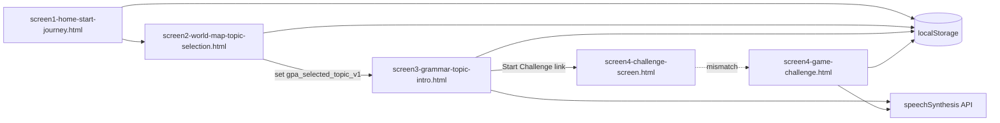

# Architecture

## System Overview
Repository now has a dual-runtime state:
- Legacy static prototype with Stitch-derived HTML screens and embedded JavaScript.
- New Next.js App Router scaffold for incremental React migration.

## Runtime Components
- UI layer (legacy): static HTML in `src/ui/stitch/`.
- UI layer (new): Next.js App Router pages in `app/`.
- Topic curriculum metadata: shared catalog in `src/lib/topicCatalog.js`.
- Styling (legacy): Tailwind via CDN + inline `tailwind.config`.
- Styling (new): Tailwind CSS via PostCSS build pipeline.
- State: localStorage keys:
  - `gpa_player_profile_v1`
  - `gpa_selected_topic_v1`
  - `gpa_voice_settings_v1`
  - Active-player compatibility mirrors:
    - `gpa_player_progress_v1`
    - `gpa_pet_accessories_v1`
    - `gpa_topic_attempt_history_v1`
  - Player-scoped persistence keys:
    - `gpa_player_progress_v1__player__{playerId}`
    - `gpa_pet_accessories_v1__player__{playerId}`
    - `gpa_topic_attempt_history_v1__player__{playerId}`
- Voice: browser `speechSynthesis` in topic intro and challenge screens.
- Navigation (legacy): relative links and `window.location.href`.
- Navigation (new): Next.js route navigation (`next/navigation`).

## Tech Stack (Current)
| Area | Current Choice | Version Status |
|---|---|---|
| App Framework | Next.js (App Router) | `14.2.5` |
| UI Runtime | React | `18.2.0` |
| Markup | HTML5 + JSX | Active migration |
| Styling | Tailwind CSS (build-time) + Tailwind CDN (legacy) | Build stack pinned; legacy CDN remains |
| Script | React components + legacy Vanilla JavaScript | Mixed during migration |
| Fonts | Google Fonts (`Spline Sans`) | CDN/latest, exact version TBD |
| Icons | Material Symbols | CDN/latest, exact version TBD |
| Storage | Browser `localStorage` | Browser-provided |
| Voice | `SpeechSynthesisUtterance` | Browser-provided |

## Key Architectural Decisions
- Keep Stitch raw exports in `_bmad-output/implementation-artifacts/stich-export/`.
- Keep working, editable copies in `src/ui/stitch/`.
- Add Next.js scaffold at repo root (`app/`, `package.json`, Tailwind/PostCSS configs) for gradual migration.
- Migrate Screen 1 behavior first into `app/page.js` while preserving legacy source for verification.
- Use a shared topic catalog (`src/lib/topicCatalog.js`) so topic-intro and challenge consume the same aspect definitions.
- Use local-first persistence for MVP (no backend dependency yet).
- Persist learner return state (name, selected pet, progress, accessories) and restore it on app entry to avoid repeated onboarding.
- Keep gameplay rules defined in planning artifacts before engine wiring.

## Planned Persistence Contract (MVP)
- Player profile (`gpa_player_profile_v1`): learner display name + selected pet identity + `playerId`.
- Player progress (`gpa_player_progress_v1__player__{playerId}`): topic completion/pass status and latest progression markers.
- Pet accessories (`gpa_pet_accessories_v1__player__{playerId}`): unlock inventory and currently equipped accessory IDs.
- Topic attempt history (`gpa_topic_attempt_history_v1__player__{playerId}`): recent challenge attempt question IDs by topic.
- Restore behavior: app boot checks versioned keys and hydrates UI before showing onboarding defaults.
- Fallback behavior: missing/corrupt keys fail safe to first-time onboarding state without runtime crash.

## Constraints
- Framework migration is in progress: legacy static pages and new React routes coexist.
- CI/security automation is GitHub Actions based (`ci.yml`, `extended-quality.yml`, `security.yml`).
- External CDN dependency for style/fonts/icons and image assets.
- Screen naming inconsistency exists:
  - Link target in screen 3: `screen4-challenge-screen.html`
  - Actual file: `screen4-game-challenge.html`
- Raw export folder intentionally misspelled as `stich-export` (legacy compatibility).

## Planned Architecture (From Artifacts, Not Implemented Yet)
- Vertical slices S1-S5 from implementation plan:
  - Foundation/topic intro
  - Challenge engine
  - Results/retry loop
  - Rewards/customization
  - Evolution/dashboard
- Domain entities and rules defined in functional requirements, pending code implementation.

## Challenge Runtime State Model (Planned MVP)
- Question lifecycle state machine:
  - `loading_question` -> `ready` -> `selecting`
  - `correct_first` or `wrong_first`
  - `guided_retry` -> `selecting`
  - `correct_second` or `wrong_second`
  - `assisted` (coached retry)
    - coached correct -> `await_acknowledge` -> `post_answer`
    - coached wrong -> `post_answer` (`skipped`, no XP)
  - `award_xp` -> `update_progress` -> next question or level complete
- Attempt constraints:
  - Maximum two independent attempts per question.
  - Second wrong does not auto-complete or auto-award XP.
  - One coached retry is allowed in `assisted`; wrong coached retry advances with `skipped`.
- Feedback contract:
  - Pre-answer hero message is hint-only (non-revealing).
  - Post-answer hero message is explanation-oriented and includes correct-answer reasoning when needed.
  - Pet copy is emotional encouragement and never punitive.
  - Challenge narration reads hero text then question text at each new question start; same-question hero updates narrate hero only.
- UI indicator model:
  - `first_try_correct` -> `⭐`
  - `second_try_correct` -> `☆`
  - `assisted_resolution` -> `✓`
- Scoring model:
  - Base XP: first try 10, second try 8, assisted 3, skip 0.
  - End-of-level XP equals earned base XP (no bonus XP layer).
- Persistence additions:
  - `gpa_player_progress_v1__player__{playerId}` should store per-question outcome class plus challenge summary/base-XP snapshots.

## Migration Status
- ✅ Next.js app scaffold created (`package.json`, `app/layout.js`, `app/globals.css`, `app/page.js`).
- ✅ Screen 1 onboarding ported to React route `/` with validation + pet selection behavior.
- ✅ Canonical clean routes enabled for migrated screens: `/world-map` and `/topic-intro`.
- ✅ Backward compatibility redirects are configured in `next.config.mjs` for legacy paths `/screen2-world-map-topic-selection` -> `/world-map`, `/screen3-grammar-topic-intro` -> `/topic-intro`, and `/screen4-game-challenge` -> `/challenge`.
- 🟡 Screen 2 behavior is implemented directly in `app/world-map/page.js` while legacy Stitch source remains for migration traceability.
- 🟡 Screen 3 and Screen 4 have active React routes (`/topic-intro`, `/challenge`) with legacy Stitch files retained for migration traceability and visual reference.

## Architecture TBDs
- Data/service boundary for question bank source is TBD.
- Error telemetry and analytics instrumentation are TBD.

## Source References
- `_bmad-output/planning-artifacts/functional-requirements-mvp.md`
- `_bmad-output/planning-artifacts/implementation-slices-feature-and-screen-plan.md`
- `_bmad-output/implementation-artifacts/stitch-import-status.md`
- `src/ui/stitch/screen1-home-start-journey.html`
- `src/ui/stitch/screen2-world-map-topic-selection.html`
- `src/ui/stitch/screen3-grammar-topic-intro.html`
- `src/ui/stitch/screen4-game-challenge.html`
- `app/layout.js`
- `app/page.js`
- `app/world-map/page.js`
- `app/topic-intro/page.js`
- `app/challenge/page.js`
- `src/lib/topicCatalog.js`
- `src/lib/playerStorage.js`
