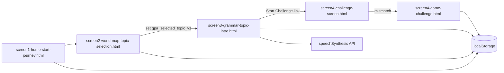

# Architecture

## System Overview
Current repository state is a static, browser-only prototype with Stitch-derived HTML screens and embedded JavaScript.

## Runtime Components
- UI layer: static HTML in `src/ui/stitch/`.
- Styling: Tailwind via CDN + inline `tailwind.config`.
- State: localStorage keys:
  - `gpa_player_profile_v1`
  - `gpa_selected_topic_v1`
  - `gpa_voice_settings_v1`
  - `gpa_player_progress_v1` (planned)
  - `gpa_pet_accessories_v1` (planned)
- Voice: browser `speechSynthesis` in topic intro screen.
- Navigation: relative links and `window.location.href`.

## Tech Stack (Observed)
| Area | Current Choice | Version Status |
|---|---|---|
| Markup | HTML5 | No explicit version pin |
| Styling | Tailwind CDN (`cdn.tailwindcss.com`) | CDN/latest, exact version TBD |
| Script | Vanilla JavaScript in page `<script>` tags | No build/transpile step |
| Fonts | Google Fonts (`Spline Sans`) | CDN/latest, exact version TBD |
| Icons | Material Symbols | CDN/latest, exact version TBD |
| Storage | Browser `localStorage` | Browser-provided |
| Voice | `SpeechSynthesisUtterance` | Browser-provided |

## Key Architectural Decisions
- Keep Stitch raw exports in `_bmad-output/implementation-artifacts/stich-export/`.
- Keep working, editable copies in `src/ui/stitch/`.
- Use local-first persistence for MVP (no backend dependency yet).
- Persist learner return state (name, selected pet, progress, accessories) and restore it on app entry to avoid repeated onboarding.
- Keep gameplay rules defined in planning artifacts before engine wiring.

## Planned Persistence Contract (MVP)
- Player profile (`gpa_player_profile_v1`): learner display name + selected pet identity.
- Player progress (`gpa_player_progress_v1`): topic completion/pass status and latest progression markers.
- Pet accessories (`gpa_pet_accessories_v1`): unlock inventory and currently equipped accessory IDs.
- Restore behavior: app boot checks versioned keys and hydrates UI before showing onboarding defaults.
- Fallback behavior: missing/corrupt keys fail safe to first-time onboarding state without runtime crash.

## Constraints
- No package manager manifest (`package.json`) and no formal build/test scripts.
- No CI pipeline or workflow automation defined in repo.
- External CDN dependency for style/fonts/icons and image assets.
- Screen naming inconsistency exists:
  - Link target in screen 3: `screen4-challenge-screen.html`
  - Actual file: `screen4-game-challenge.html`
- Raw export folder intentionally misspelled as `stich-export` (legacy compatibility).

## Planned Architecture (From Artifacts, Not Implemented Yet)
- Vertical slices S1-S5 from implementation plan:
  - Foundation/topic intro
  - Challenge engine
  - Results/retry loop
  - Rewards/customization
  - Evolution/dashboard
- Domain entities and rules defined in functional requirements, pending code implementation.

## Architecture TBDs
- Final app framework choice (React/Next/Vue/etc.) is TBD.
- Data/service boundary for question bank source is TBD.
- Production deployment topology is TBD.
- Error telemetry and analytics instrumentation are TBD.

## Source References
- `_bmad-output/planning-artifacts/functional-requirements-mvp.md`
- `_bmad-output/planning-artifacts/implementation-slices-feature-and-screen-plan.md`
- `_bmad-output/implementation-artifacts/stitch-import-status.md`
- `src/ui/stitch/screen1-home-start-journey.html`
- `src/ui/stitch/screen2-world-map-topic-selection.html`
- `src/ui/stitch/screen3-grammar-topic-intro.html`
- `src/ui/stitch/screen4-game-challenge.html`
